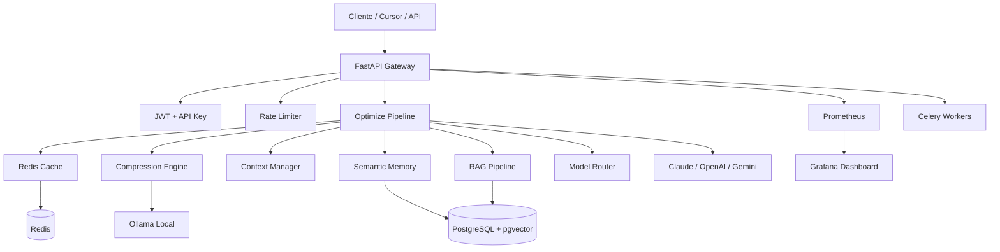

# AI Token Suppressor

Camada intermediária inteligente entre aplicações (Cursor, VSCode, APIs, agentes, bots) e modelos LLM (Claude, OpenAI, Gemini, OpenRouter) para reduzir drasticamente o consumo de tokens.

## Objetivo

Reduzir uso de tokens em **60% a 95%** sem perda significativa de qualidade, através de:

- Compressão de contexto e prompt minification
- Memória semântica com pgvector
- RAG com chunking inteligente
- Cache semântico Redis
- Deduplicação por hashing e embeddings
- Roteamento inteligente de modelos
- Telemetria e analytics em tempo real

## Arquitetura

```
Usuário/App → Token Suppressor API → Compression Pipeline → Memory/RAG → Prompt Optimizer → Claude/OpenAI
```



## Stack

| Componente | Tecnologia |
|-----------|-----------|
| Backend | Python 3.12, FastAPI, Uvicorn, AsyncIO |
| Banco | PostgreSQL + pgvector |
| Cache | Redis |
| LLM Local | Ollama (llama3.2, nomic-embed-text) |
| Fila | Celery + Redis + Flower |
| Frontend | React, Vite, Tailwind, Recharts |
| Observabilidade | Prometheus + Grafana |
| Container | Docker + Docker Compose |

## Arquitetura Enterprise v2

```
NGINX → LiteLLM Gateway → FastAPI API → Context Engine → Compression Pipeline
                                              ↓
                                    Semantic Memory (L1/L2/L3)
                                              ↓
                                    RAG + Context Graph → Adaptive Optimizer → LLM
```

### Novos Serviços (v2)

| Serviço | Função |
|---------|--------|
| `ContextGraphService` | Memória em grafo com NetworkX |
| `RelevanceService` | Scoring de importância semântica |
| `ASTService` | Compressão code-aware via AST |
| `ChunkingService` | Chunking semântico/AST |
| `DiffService` | Diff semântico incremental |
| `CodebaseService` | Indexação de projetos |
| `FingerprintService` | MinHash + LSH para cache |
| `HierarchicalMemoryService` | L1 Redis / L2 pgvector / L3 cold |
| `SemanticLossService` | Detecção de perda semântica |
| `SpecializedCompressionService` | Compressão por tipo de conteúdo |
| `QualityGuardService` | Preservação de instruções críticas |
| `BenchmarkService` | Benchmark de estratégias |
| `CostOptimizerService` | Otimização cost-aware |
| `StreamingService` | Compressão streaming |
| `LiteLLMService` | Gateway multi-provider |

### Novos Endpoints

| Método | Endpoint | Descrição |
|--------|----------|-----------|
| POST | `/advanced/benchmark` | Benchmark de estratégias |
| POST | `/advanced/heatmap` | Token heatmap |
| POST | `/advanced/graph/query` | Context graph query |
| POST | `/advanced/codebase/index` | Indexar codebase |
| POST | `/advanced/stream/compress` | Compressão streaming |

## Quick Start

### Pré-requisitos

- Docker e Docker Compose
- 8GB+ RAM (Ollama precisa de memória para modelos locais)

### 1. Clone e configure

```bash
git clone <repo-url> AiTokenSuppressor
cd AiTokenSuppressor
cp .env.example .env
```

### 2. Suba toda a stack

```bash
docker compose up -d --build
```

Aguarde o `ollama-init` baixar os modelos (~2-5 min na primeira execução).

### 3. Acesse os serviços

| Serviço | URL |
|---------|-----|
| API | http://localhost:8000 |
| Swagger | http://localhost:8000/docs |
| Dashboard | http://localhost:5173 |
| Grafana | http://localhost:3000 (admin/admin) |
| Prometheus | http://localhost:9090 |
| Flower (Celery) | http://localhost:5555 |

### 4. Teste a API

```bash
curl -X POST http://localhost:8000/compress \
  -H "X-API-Key: ats-dev-api-key-change-in-production" \
  -H "Content-Type: application/json" \
  -d '{
    "messages": [
      {"role": "user", "content": "Please note that it is important to remember that we need to implement the REST API endpoint with proper authentication and error handling."}
    ],
    "strategy": "aggressive"
  }'
```

## Endpoints

| Método | Endpoint | Descrição |
|--------|----------|-----------|
| POST | `/optimize` | Pipeline completo de otimização |
| POST | `/compress` | Compressão de prompt |
| POST | `/analyze` | Análise de complexidade e estimativa |
| POST | `/memory/save` | Salvar memória semântica |
| POST | `/memory/search` | Busca semântica de memórias |
| POST | `/rag/ingest` | Ingerir documento no RAG |
| POST | `/rag/query` | Consulta RAG |
| GET | `/stats` | Estatísticas e analytics |
| GET | `/health` | Health check básico |
| GET | `/health/full` | Health check completo |
| GET | `/metrics` | Métricas Prometheus |
| POST | `/auth/login` | Autenticação JWT |

## Estratégias de Compressão

| Estratégia | Target Ratio | Uso |
|-----------|-------------|-----|
| `aggressive` | ~35% | Máxima economia |
| `balanced` | ~50% | Uso geral (default) |
| `ultra` | ~20% | Economia extrema |
| `semantic` | ~45% | Preserva significado |
| `code-focused` | ~60% | Preserva código |
| `chat-focused` | ~48% | Conversas longas |

## Autenticação

Duas formas suportadas:

```bash
# API Key
curl -H "X-API-Key: sua-api-key" ...

# JWT
curl -H "Authorization: Bearer <token>" ...
# Obter token:
curl -X POST http://localhost:8000/auth/login \
  -H "Content-Type: application/json" \
  -d '{"username":"admin","password":"admin123"}'
```

## Desenvolvimento Local

### Backend

```bash
cd backend
python -m venv .venv
source .venv/bin/activate  # Windows: .venv\Scripts\activate
pip install -r requirements.txt
uvicorn app.main:app --reload --port 8000
```

### Frontend

```bash
cd frontend
npm install
npm run dev
```

### Testes

```bash
cd backend
pytest -v
```

## Setup Ollama (VPS / Bare Metal)

```bash
# Instalar Ollama
curl -fsSL https://ollama.com/install.sh | sh

# Baixar modelos
ollama pull llama3.2:3b
ollama pull nomic-embed-text

# Verificar
ollama list
curl http://localhost:11434/api/tags
```

Configure no `.env`:
```
OLLAMA_BASE_URL=http://localhost:11434
OLLAMA_MODEL=llama3.2:3b
OLLAMA_EMBED_MODEL=nomic-embed-text
```

## Integração automática (Cursor / OpenAI SDK)

O endpoint **`POST /v1/chat/completions`** comprime o prompt e encaminha ao LLM (formato OpenAI).

### Cursor

1. **Settings → Models → OpenAI API Key:** sua `API_KEY` do `.env` (ex: `ats-super-api-key`)
2. **Override OpenAI Base URL:** `http://SEU_IP:8100/v1` (ou `http://localhost:8105/v1` direto na API)
3. Modelo: `gpt-4o-mini`, `gpt-4o`, `claude-3-5-sonnet-20241022`, etc.
4. Configure no `.env` a chave do provedor real (`OPENAI_API_KEY`, `ANTHROPIC_API_KEY`, …)

Headers opcionais:

| Header | Valores | Descrição |
|--------|---------|-----------|
| `X-ATS-Strategy` | `balanced`, `ultra`, `code-focused`, … | Estratégia de compressão |
| `X-ATS-Pipeline` | `compress` (rápido) / `optimize` (completo) | Pipeline |
| `X-ATS-Use-Ollama` | `true` / `false` | Usar Ollama na compressão |
| `X-ATS-Skip-Optimize` | `true` | Pular compressão (só repassa) |

Resposta inclui headers `X-ATS-Tokens-Before`, `X-ATS-Tokens-After`, `X-ATS-Tokens-Saved`.

### curl

```bash
curl -s http://localhost:8105/v1/chat/completions \
  -H "Authorization: Bearer ats-super-api-key" \
  -H "Content-Type: application/json" \
  -d '{
    "model": "gpt-4o-mini",
    "messages": [{"role": "user", "content": "Explique FastAPI em detalhes..."}],
    "stream": false
  }'
```

### Integração manual (legado)

```python
import httpx

async def optimize_before_llm(messages: list[dict]) -> list[dict]:
    async with httpx.AsyncClient() as client:
        response = await client.post(
            "http://localhost:8000/optimize",
            headers={"X-API-Key": "sua-api-key"},
            json={
                "messages": messages,
                "strategy": "balanced",
                "target_model": "claude-3-5-sonnet",
                "use_memory": True,
            },
        )
        data = response.json()
        return data["messages"]
```

## Estrutura do Projeto

```
AiTokenSuppressor/
├── backend/
│   ├── app/
│   │   ├── api/           # Routes e dependencies
│   │   ├── core/          # Config, DB, Redis, Security
│   │   ├── middleware/    # Rate limit, payload limit
│   │   ├── models/        # SQLAlchemy ORM
│   │   ├── repositories/  # Data access layer
│   │   ├── schemas/       # Pydantic models
│   │   ├── services/      # Business logic
│   │   ├── workers/       # Celery tasks
│   │   └── utils/         # Helpers
│   ├── tests/
│   └── Dockerfile
├── frontend/
│   └── src/
│       ├── components/
│       ├── pages/
│       └── services/
├── prometheus/
├── grafana/
├── docs/
└── docker-compose.yml
```

## Postman Collection

Importe `docs/postman_collection.json` no Postman ou Insomnia.

## Monitoramento

- **Prometheus**: métricas de tokens economizados, latência, cache hits
- **Grafana**: dashboard pré-configurado em `grafana/dashboards/`
- **Flower**: monitoramento de tasks Celery

## Licença

MIT
